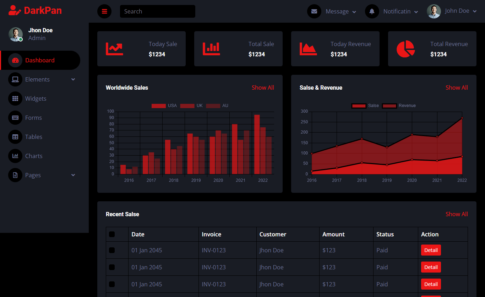

# Taksun Simple Web Server 

## Table of Contents
- [Introduction](#introduction)
- [Backend Development](#backend-development)
- [Frontend Development](#frontend-development)
- [Using Internet Template Code](#using-internet-template-code)
- [Implementing AJAX](#implementing-ajax)
- [Using JavaScript Timer](#using-javascript-timer)
- [Data Visualization with Chart.js](#data-visualization-with-chartjs)
- [Hardware and Vivado](#hardware-and-vivado)
- [XADC Driver in Linux](#xadc-driver-in-linux)
- [Web Server Sample Code for Backend](#web-server-sample-code-for-backend)

## Introduction
In this project, a web interface has been set up. To implement it, 3 main parts are needed:

1. Backend program  
2. Web interface for the client  
3. Hardware  

## Backend Development
Backend programming for a web server using Python involves creating the server-side logic that handles requests from clients, processes data, interacts with databases, and sends responses back to the client.

### Key Components of Backend Programming
1. **Web Server**: Software that listens for incoming HTTP requests and sends back responses.
2. **HTTP Protocol**: Methods like GET, POST, PUT/PATCH, DELETE.
3. **Routing**: Maps URLs to specific functions.
4. **Request Handling**: Processes incoming requests and extracts data.
5. **Response Generation**: Sends responses in HTML, JSON, etc.
6. **Database Interaction**: Libraries for PostgreSQL, MySQL, etc.
7. **Authentication**: Handles user login and permissions.
8. **Middleware**: Code that runs before/after main request handler.

### Python Frameworks
1. **Flask**: Lightweight micro-framework.
2. **Django**: Full-stack framework with many built-in features.
3. **FastAPI**: Modern framework for building APIs.
4. **Built-in `http.server`**: Basic HTTP server for simple use cases (used in this example).

## Frontend Development
Client web-based interfaces are built using:

1. **HTML**: Structure and content.
2. **CSS**: Styling and design.
3. **JavaScript**: Interactivity and dynamic behavior.

## Using Internet Template Code
Instead of writing code from scratch, use template code from:  
[https://themewagon.github.io/darkpan/](https://themewagon.github.io/darkpan/)



## Implementing AJAX
AJAX (Asynchronous JavaScript and XML) allows web pages to communicate with a server asynchronously without full page reloads. Example JavaScript code:

```javascript
function fetchData() {
  fetch('posts/1')
    .then(response => response.json())
    .then(data => {
      addData(lab, data.val[0], data.val[1]);
      lab = lab + 1;
      document.getElementById('result').innerHTML = `
        <h2>Title: ${data.title}</h2>
        <p>Body: ${data.val}</p>`;
    })
    .catch(error => {
      document.getElementById('result').innerHTML = 'Error fetching data';
    });
}
```
